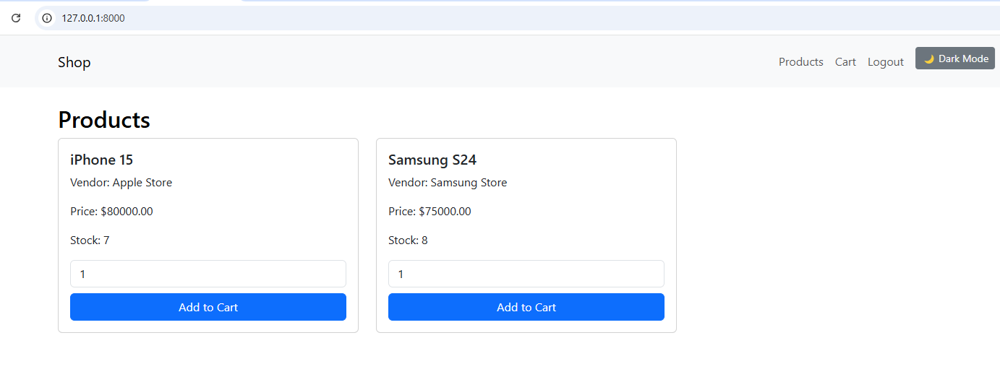
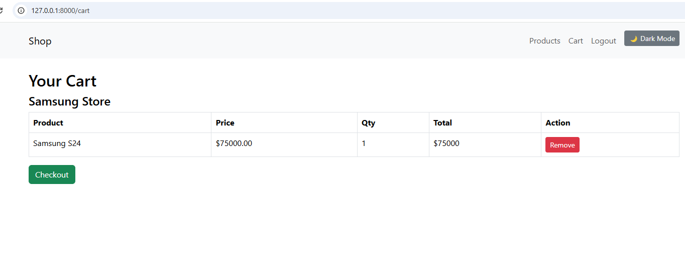
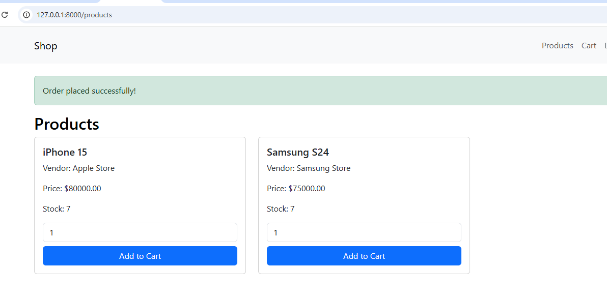
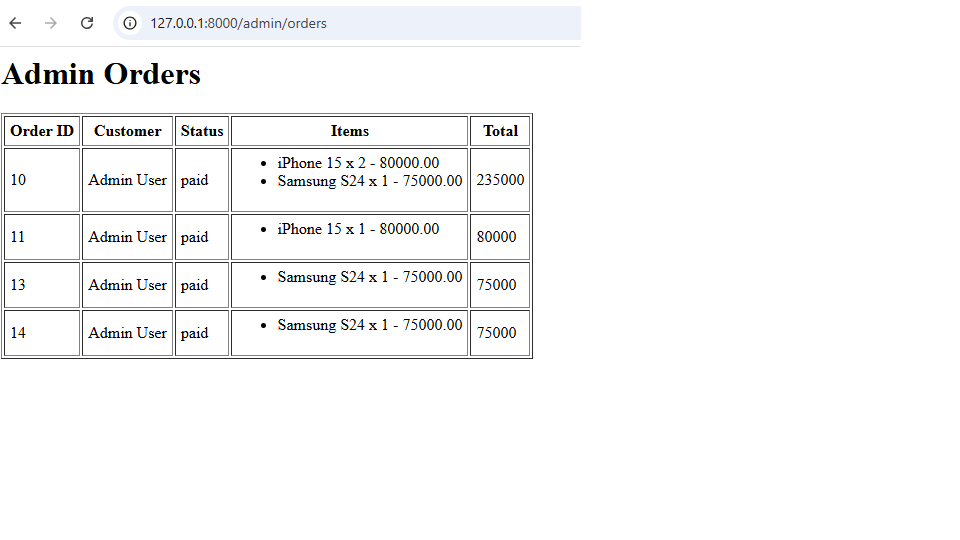

##Checkout System

Checkout now creates a single order for all items in the cart, regardless of how many vendors the products belong to.

Each order_item stores the correct vendor_id, ensuring vendor-specific info is preserved.

Stock for products is automatically reduced after checkout.

A payment record is created for the total order amount.

Cart items are cleared after a successful checkout.

##Order Items

order_items table now includes the vendor_id column.

This allows accurate tracking of which vendor supplied each product.

Ensures admin reports and order management work correctly.

##Admin Orders Page

Admin panel displays all items for an order in a single row, no splitting by vendor.

Each item shows:

Product name

Quantity

Price

Total is automatically calculated as the sum of all items in the order.

The interface is simplified — no vendor grouping unless needed later.

##Bug Fixes

Fixed SQL errors related to vendor_id being NULL.

Mass assignment updated for OrderItem to include vendor_id.

CheckoutService updated to handle multiple products correctly in one order.

##Notes for Developers

Run migrations after pulling changes:

php artisan migrate

Seed the database or create products with valid vendor_id.

Admin can view orders via:

/admin/orders

Ensure vendor_id is present for all products to avoid checkout errors.

### Screenshots

#### Product Listing

#### Cart

#### Checkout

#### Admin Orders
